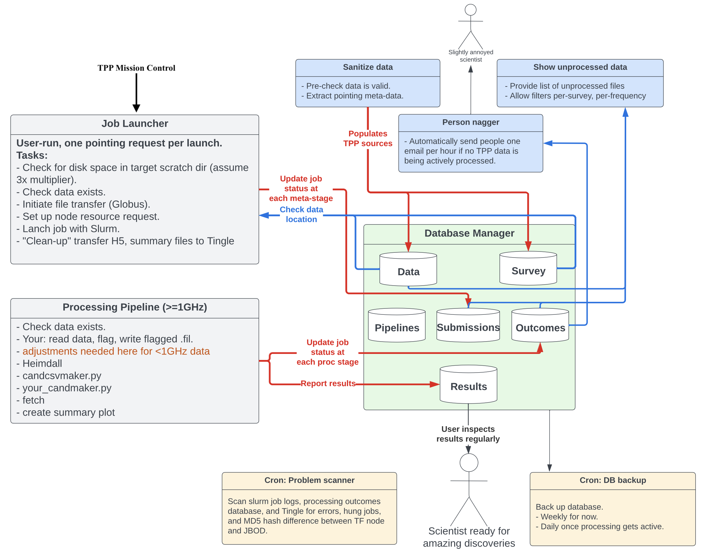

# The Petabye Project (TPP)
A project to discover radio transients over petabytes of radio data (archival as well as current) from telescopes across the globe. The project aims at implementing uniform searching algorithm through an AI powered pipeline. The uniform search also allows us to evaluate different selection function for different telescopic data for the same searching algorithm. The project was supported by National Science Foundation (NSF). The repository contains API for the TPP Pipeline to interact with MongoDB database
The repository contains API for the TPP Pipeline to interact with MongoDB database. [Here](https://github.com/thepetabyteproject/tpp) is the link to the TPP pipeline.   
**TPP Pipeline Block Diagram** 

## Table of Contents

- [__TPP Mongodb API__](page1.md)
- [__Tutorial On CRUD Operations__](page2.md)
- [__Installation and Setup__](page3.md)
- [__Advanced Guide__](page4.md)
